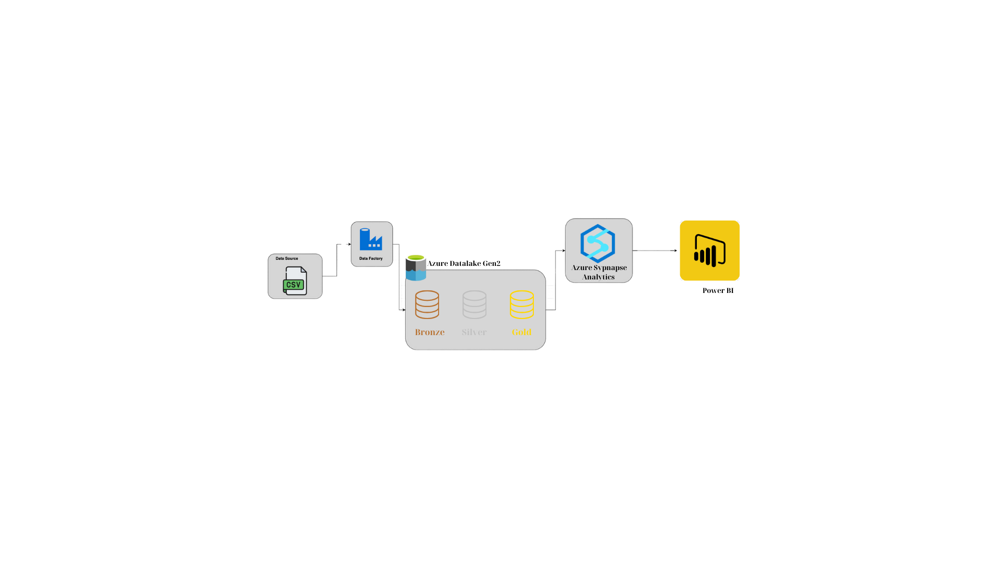
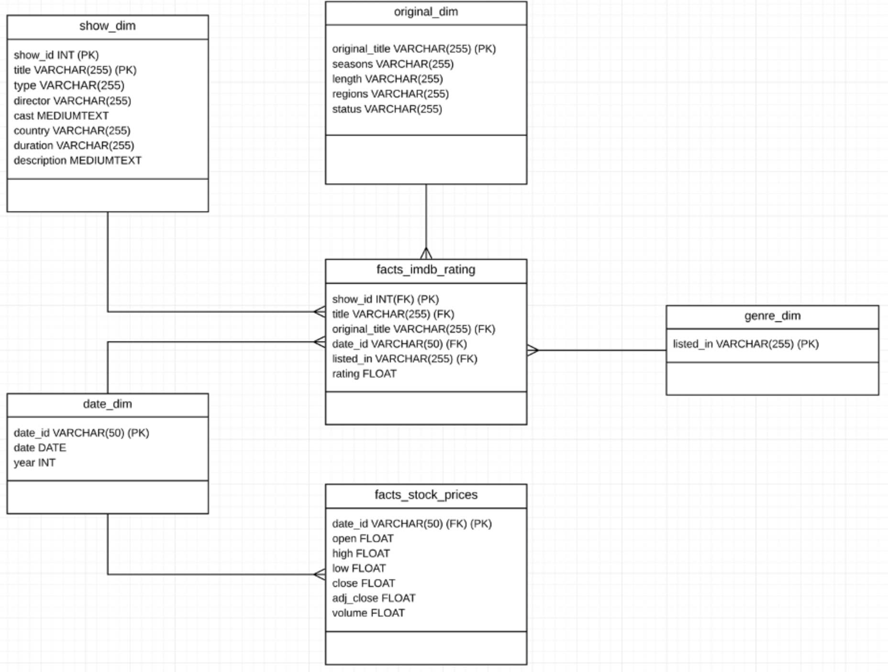
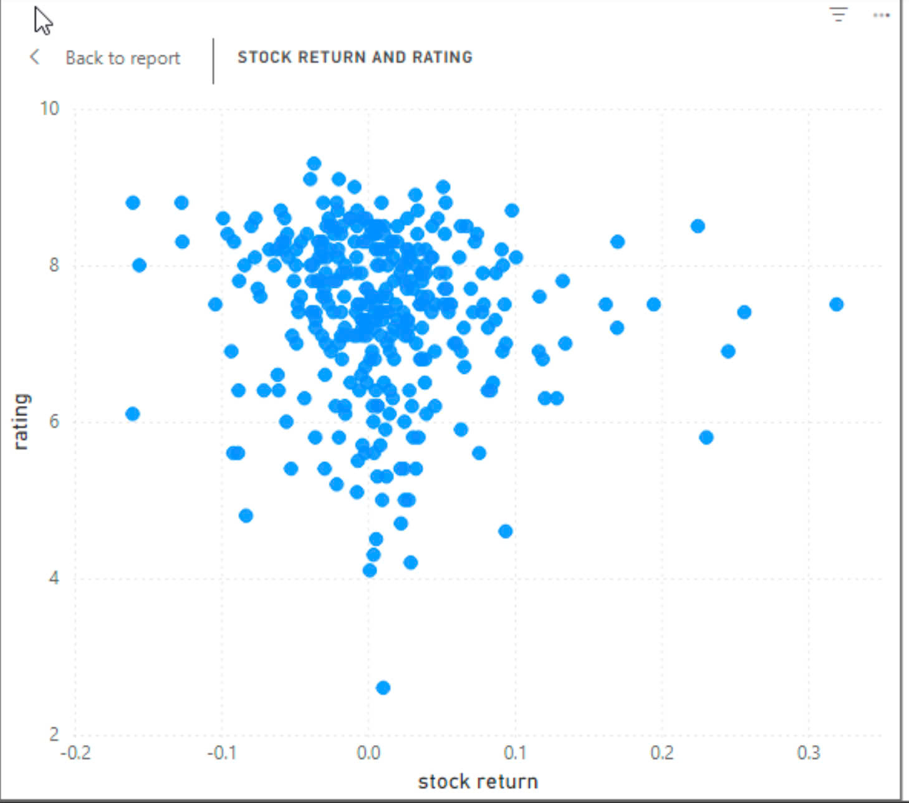
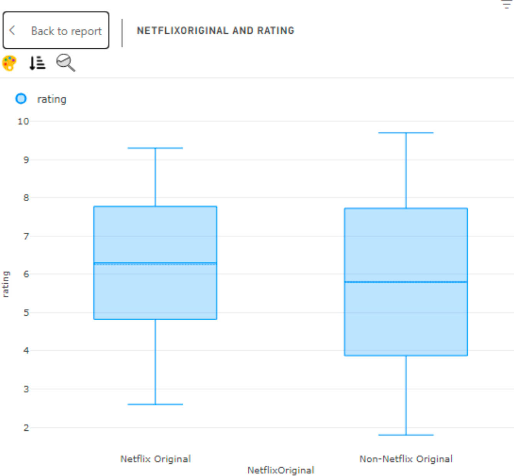

# Netflix ETL Pipeline on Azure

## Project Overview

This project demonstrates the development of an ETL (Extract, Transform, Load) pipeline for Netflix movie data using Microsoft Azure. The pipeline processes and transforms raw data into structured, insightful datasets ready for analysis and visualization.

## Problem 
There are three key questions I aim to explore:
- Do Netflix Originals have higher IMDb scores compared to non-originals?
- Is there a positive relationship between high IMDb score movies/shows and Netflix's stock prices?
- What were the movies or shows released during the periods when Netflix's stock prices peaked?

## Source Data 
I use three source files collected from Kaggle:
- NFLX.csv: Contains Netflix stock data by day, including opening, closing prices, and trading volume.
- mycsvfile.csv: Contains information on movies and shows, including IMDb scores. This dataset includes both Netflix Originals and non-originals.
- netflix_originals.csv: Lists all movies and shows produced by Netflix but does not include IMDb scores.

## Architecture

### Pipeline Architecture

The architecture of this project includes:

**Azure Data Factory**: Orchestrates the ETL pipeline by extracting raw CSV data from the source and loading it into Azure Data Lake Storage Gen2.  
**Azure Data Lake Storage Gen2**: Serves as the primary data storage, divided into three layers:  
  - **Bronze**: Stores raw data directly ingested from the source.
  - **Silver**: Contains cleansed and partially transformed data for further analysis.
  - **Gold**: Stores fully processed and enriched data ready for analytics and reporting.

**Azure Synapse Analytics**: Provides powerful querying and data processing capabilities over the structured data stored in the Gold layer.  
**Power BI**: Reads processed data from Azure Synapse Analytics to create intuitive and interactive dashboards for visualizing insights.  

### Dimensional Model

## Data Analysis and Reporting

Based on the scatterplot:  
- No strong or consistent positive relationship can be observed between higher IMDb scores and Netflix's stock prices.
- Stock price movements are likely influenced by broader market factors, financial performance, or subscription growth, rather than the IMDb scores of its content alone.

Median IMDb Scores:

- Netflix Originals have a median IMDb score around 6.5.
- Non-Netflix Originals have a median IMDb score closer to 6.
- Insight: Netflix Originals appear to have slightly higher median IMDb scores compared to non-originals.

Range of Scores:

- Both categories have similar ranges of IMDb scores, spanning from 2 to around 9.
- The interquartile range (IQR), representing the middle 50% of ratings, is slightly narrower for Netflix Originals, suggesting their ratings are more consistent.
- Non-Netflix Originals exhibit a wider IQR, indicating greater variability in their IMDb scores.

Outliers:

- Both categories include low-rated content, but the extreme low ratings (around 2) occur slightly more frequently among non-originals.
- High-rated content (above 9) is rare and similar for both groups.

